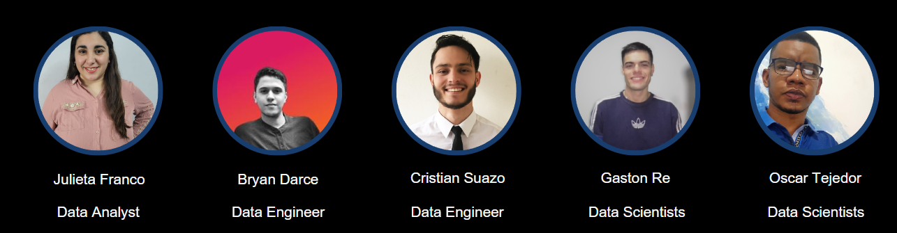

   

<h1 align="center">PROYECTO GOOGLE + YELP </h1>

   

<h1 align="center">¿Quienes somos?👥</h1>
<i>Somos una consultora ficticia de análisis de datos, llamada DATA HUNTERS. Nuestro proyecto se centra en analizar la información recopilada de plataformas de reseñas como Yelp y Google Maps. Nuestro objetivo principal es Mejorar el posicionamiento del Ratiing en restaurantes en las zonas con mayor afluencia de turistas, con el fin de comprender la experiencia, necesidades y expectativas en relación a los diferentes servicios ofrecidos a los usuarios.</i>

   

<h1 align="center">Introducción</h1>

 
Data Hunters es una consultora especializada en análisis de datos. En un mundo cada vez más digitalizado y competitivo, la información se ha convertido en el activo más valioso para la toma de decisiones estratégicas. En este contexto, nuestra misión es brindar soluciones innovadoras y precisas a través del poder del análisis de datos.

En este proyecto exploraremos los datos que permitan preferencias culinarias y tendencias emergentes en la industria de restaurantes. 

Este análisis de datos nos permite proporcionar un análisis detallado basado en los datos recopilados, brindando asesoría y recomendaciones a nuestro cliente, Esta información resultaría sumamente valiosa para la toma de decisiones estratégicas y para mejorar la reputación del negocio. Nuestro análisis permitirá a nuestro cliente tomar decisiones informadas, identificar oportunidades estratégicas y enfrentar los desafíos con confianza.

<h1 align="center">Objetivos del Proyecto</h1>

## Objetivo General(o principal):

  1. Mejorar el posicionamiento del Raiting o estrellas de los  restaurantes en ciudades con mayor afluencia de turistas() 

### Objetivos especificos:

  2. Garantizar la disponibilidad de datos limpios y estructurados

  3. Realizar un análisis exploratorio de las reseñas de usuarios

  4. Desarrollar un modelo de machine learning avanzado de recomendación

  5. Crear una interfaz interactiva que visualice y explore los resultados del análisis

<h1 align="center">¿Como lo hicimos?</h1>

1- Extracción y transformación de datos con python usando las librerias Pandas y Numpy principalmente.

2- Almacenamiento de datos limpios y estructurados con el servicio en la nube Google Cloud Storage

3- Análisis de datos en la nube conn BigQuery

4- Modelos de Machine Learning con las librerias de Scikit-learn, Keras y TensorFlow, deployados con la libreria Streamlit

5- Visualización y reportes con Google Data Looker conectado desde BigQuery

<h1 align="center">Stack Tecnológico 👨‍💻</h1>

🐍Python: Lenguaje utilizado para realizar cálculos estadísticos, crear visualizaciones de datos, construir algoritmos de aprendizaje automático, manipular y analizar datos y completar tareas relacionadas con los datos.

🐼Pandas: Librería de Python Utilizada para la manipulación y análisis de datos estructurados.

📈Matplotlib: Librería de Python utilizada para la visualización de datos y generación de gráficos.  

📘Visual Studio Code: Editor de código fuente que permite el desarrollo de las instrucciones para la ejecución de todo el proyecto.

💻**Looker Studio**: Herramienta de Google Cloud Platform que permite convertir datos en informes y paneles claros, totalmente personalizables, fáciles de consultar y compartir, lo que permite tomar decisiones basadas en datos de manera más efectiva.

  ⚡**DataFlow**: Es un servicio de procesamiento de datos que se ejecuta en recursos de Google Cloud Platform, como Compute Engine, Cloud Storage y BigQuery. Es un sistema rápido, rentable y sin servidor para el procesamiento de datos de transmisión y por lotes. Ofrece una variedad de características, como capacidades de visualización de trabajos, capacidad virtualmente ilimitada y diagnósticos inteligentes.
  

  

<h1>Autores 👥🖋</h1>

<ul>
<li>Oscar Tejedor, Data Scientist- @oscartg25</li>
<li>Julieta Franco, Data Analyst</li>
<li>Bryan Darce, Data Engineer- @BryanDarce01</li>
<li>Cristian Suazo, Data Engineer</li>
<li>Gaston Re, Data Scientist -@Gaston-Re</li>
</ul>

<h1> Herramientas 🛠</h1> 

Python, Google Data Looker, Google Cloud Storage, BigQuery, TensorFlow, Keras
 

<h1> Video del Producto 📷</h1>

